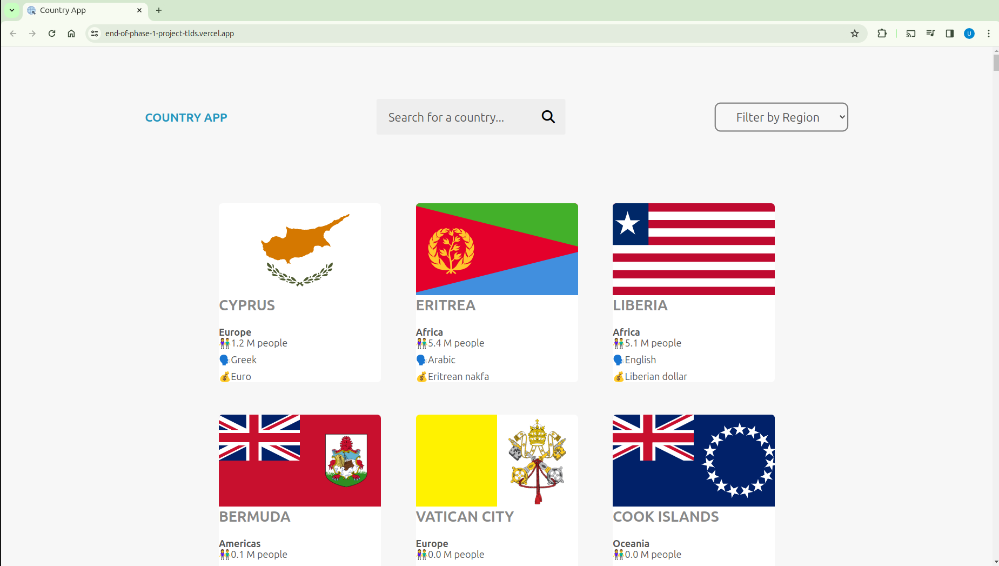
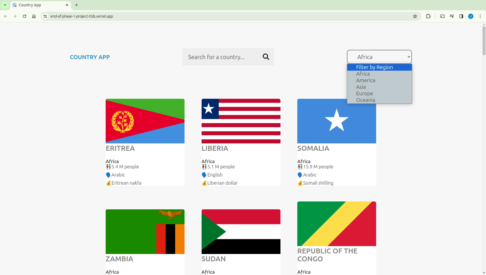
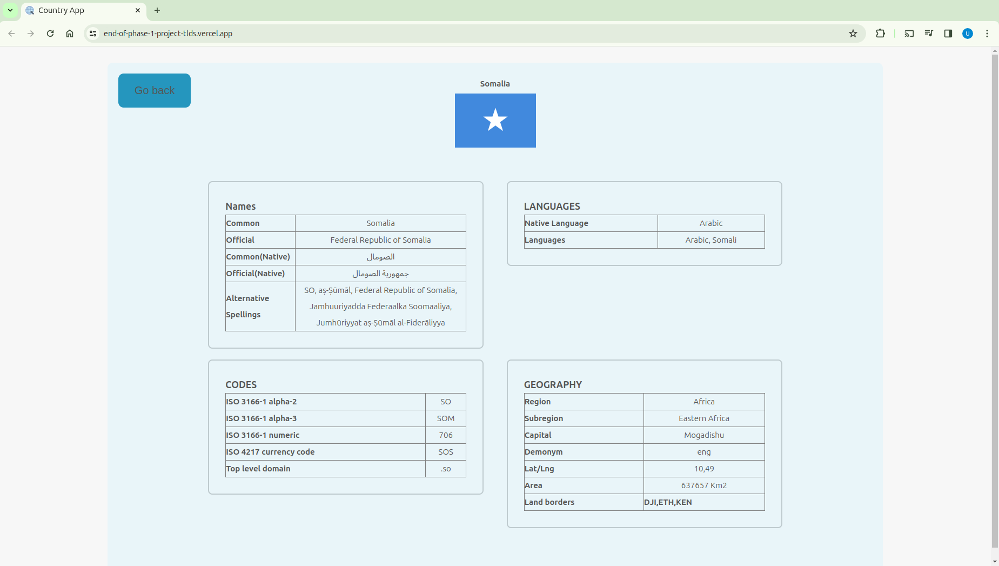
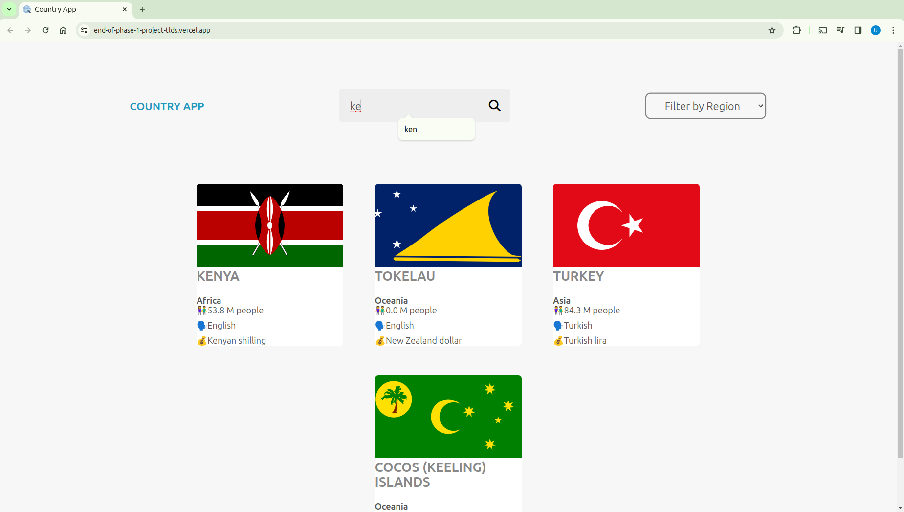

# World Countries Explorer

This is a web application designed to explore information about countries from around the world. It leverages HTML, CSS, and JavaScript to fetch data from an external API and dynamically display country details.

## Features

- **Search Functionality**: Users can search for countries by name using the search input field. As they type, the list of displayed countries dynamically updates to match the search query.

- **Region Filtering**: The application allows users to filter countries by region using the dropdown menu. Selecting a region from the menu will update the displayed countries accordingly.

- **Detailed Country Information**: Clicking on a country reveals detailed information about it, including its name, flag, population, languages spoken, currencies used, geographical location, and more.

- **Navigation**: Users can easily navigate back to the list of countries from the detailed country view by clicking the "Go back" button.
## Preview





## Files

- `index.html`: The main HTML file that structures the layout of the web page.
- `style.css`: The CSS file containing styles for the user interface.
- `script.js`: The JavaScript file responsible for fetching data from the API, filtering countries, and displaying country information dynamically.

## Installation and Usage

1. Clone the repository to your local machine:

   ```
    [git clone] https://github.com/ahabab23/End-of-phase-1-project.git
   ```

2. Open the `index.html` file in a web browser to launch the application.

3. Use the search input to find specific countries by name.

4. Filter countries by region using the dropdown menu.

5. Click on a country to view detailed information about it.

6. To return to the list of countries, click the "Go back" button.

## Technologies Used

- HTML
- CSS
- JavaScript

## External API

This project utilizes the [REST Countries API](https://restcountries.com/v3.1/all) to fetch data about countries, including their names, flags, populations, languages, currencies, and more.

## Acknowledgments

This project was created by Uwes Ahabab. Special thanks to the developers of the REST Countries API for providing the data.

## License

This project is licensed under the [MIT License](LICENSE).

## Contacts
- **Email**: Uwess529300@gmail.com
- **Tel No**: +254711854819


